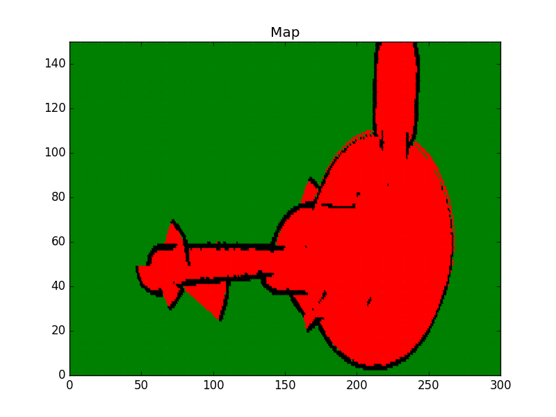

## Objective
* This map is the one generated with the [occupancy grid mapping](https://github.com/sidharth2189/RoboND-OccupancyGridMappingAlgorithm) algorithm using both sonar and odometry data. 
* The aim is to find the shortest path for the robot to cross from start o to goal ***** position.

## Given

#### Map(300x150) 
The map data stored in the map.txt file in form of log odds values. As a reminder, here's how you should interpret these numbers:

* A cell is considered unknown if its log odds value is equal to 0.
* A cell is considered as occupied if its log odds is larger than 0.
* A cell is considered as free if its log odds value is less than 0.

Grid(300x150): The log odds values converted to 0’s and 1’s where 0 represents the free space and 1 represents the occupied or unknown space.

#### Robot Start position
230,145

#### Robot Goal Position 
60,50

#### Direction of Movement 
Up(-1,0) - left(0,-1) - down(1,0) - right(0,1)

#### Movement Arrows
Up(^) - left(<) - down(v) - right(>)

#### Cost of Movement
1

#### Heuristic Vector
[Manhattan](https://en.wikipedia.org/wiki/Taxicab_geometry)

#### Functions in the code
* [A*](../Discrete_PP/a_star.cpp)
* 3 New functions in Map class
    * ```GetMap``` function which reads the map.txt log odds values and assign them the map variable.
    * ```MapToGrid``` function in order to convert the log odds values to 0’s and 1’s. These 0 and 1 values will be assigned to the grid variable.
    * ```GeneratedHeuristic``` function is another function that you have to code in order to generate a Manhattan-based heuristic vector by computing the Manhattan distance of each cell with respect to the goal position. 

The Manhattan distance of each cell can be calculated as follows.<br />
x<sub>d</sub> = x<sub>goal</sub> - x<sub>cellposition</sub><br />
y<sub>d</sub> = y<sub>goal</sub> - y<sub>cellposition</sub>

Manhattan distance d = |x<sub>d</sub>| + |y<sub>d</sub>|
<br />
<br />
[Reference](https://github.com/sidharth2189/RoboND-A-Visualization)
